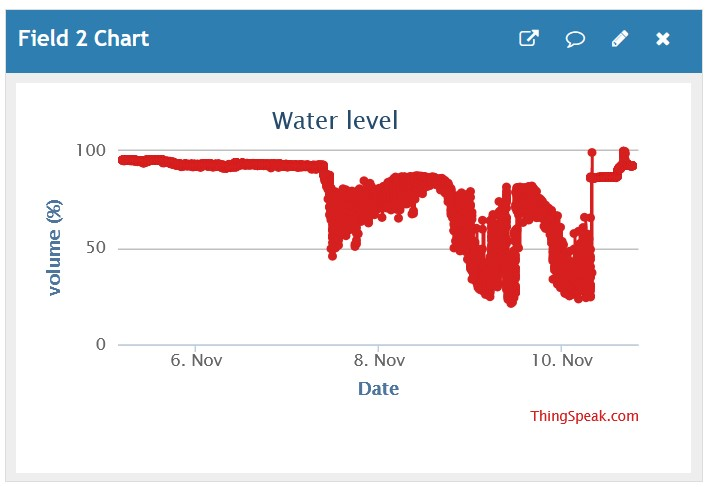

# Current issue: condensation on the sensor

## The problem

In november 2020 the measurement suddenly became unstable.

I had a look at the sensor and apparently there was so much condensation,
that some big drops of water where hanging at the bottom (active side) of the sensor.

Drying the sensor made the measurement stable again.

However, this is not a solution.

Some modification will be needed.

Come back later to see if I found a working solution...

My first idea is to turn the sensor by 90°, so that any condensation
can drip downwards, away from the active area of the sensor.
It is to be investigated if this, combined with a reflection plate at 45° can work.
