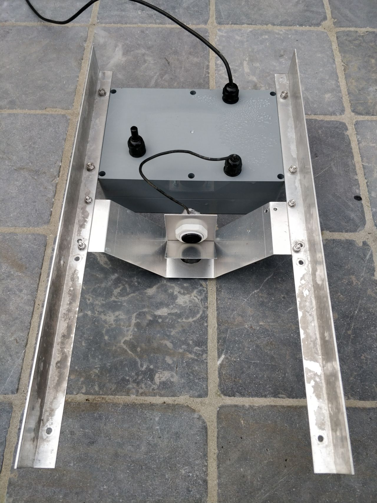
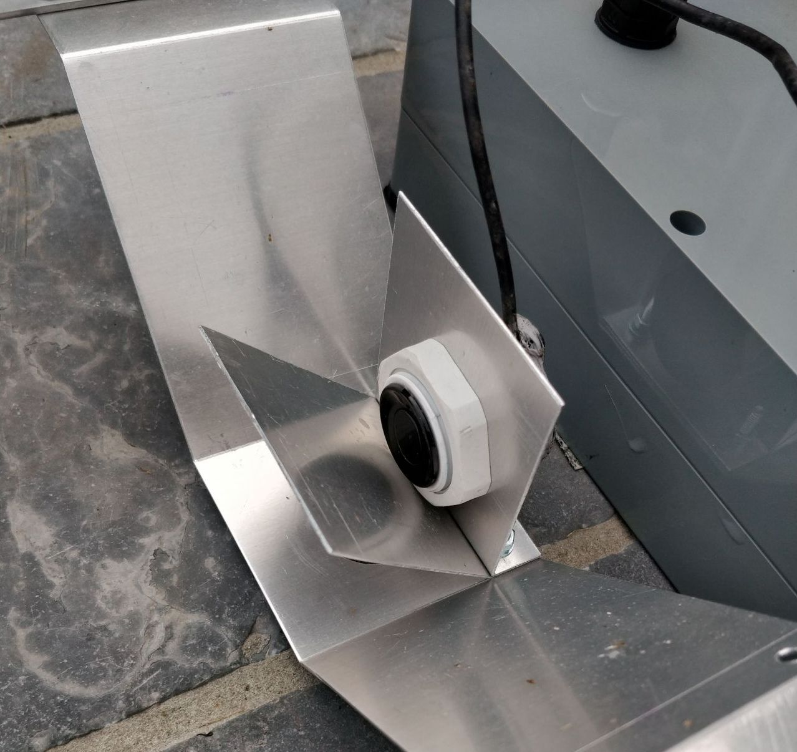
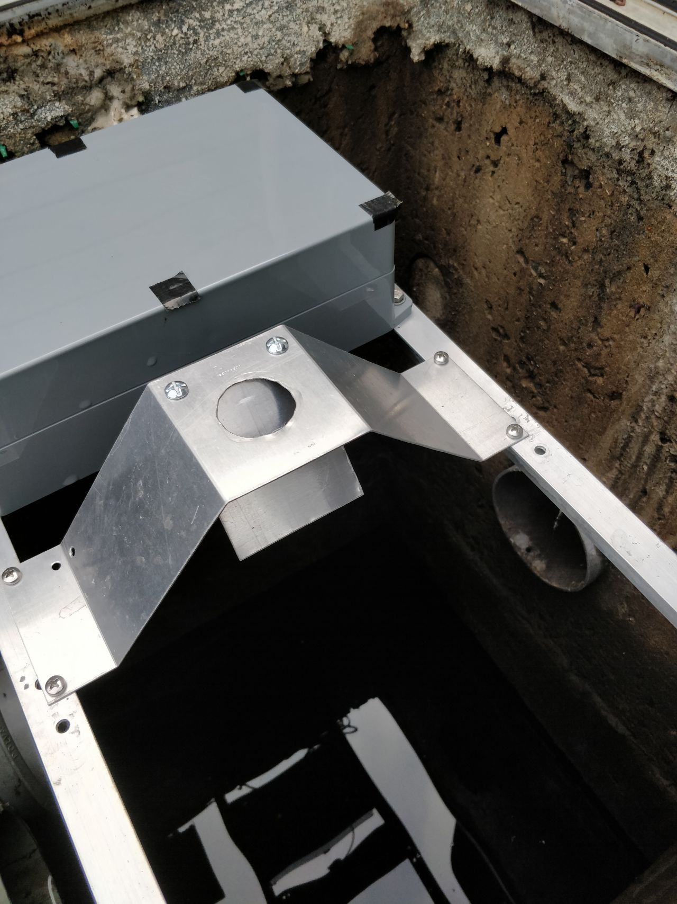
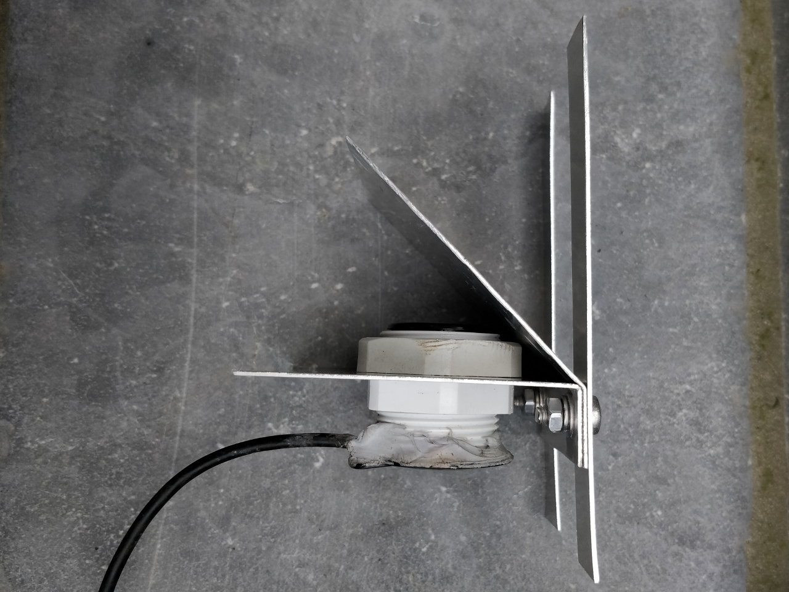
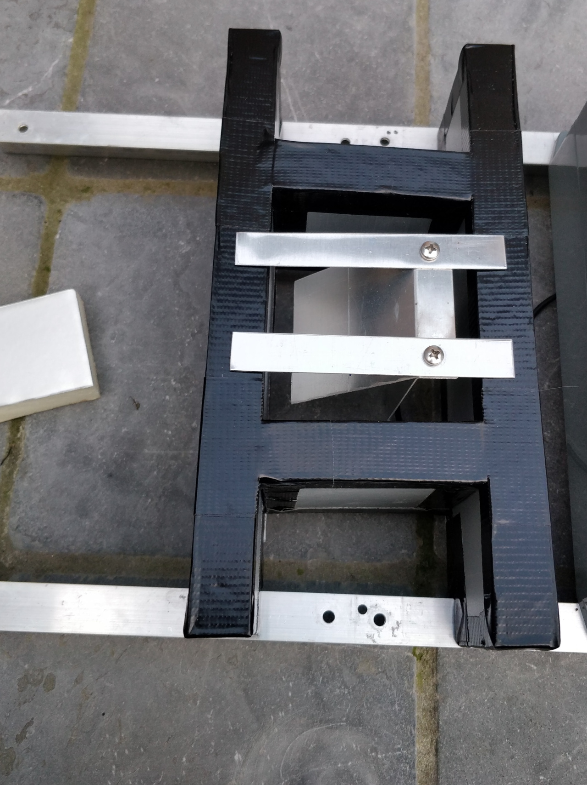
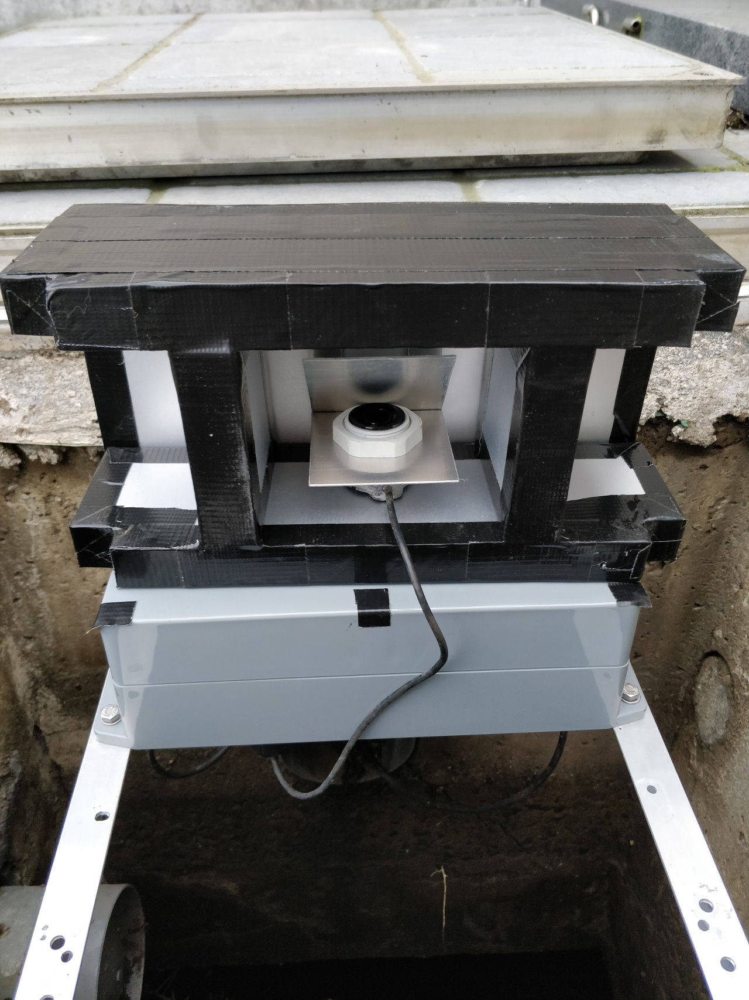
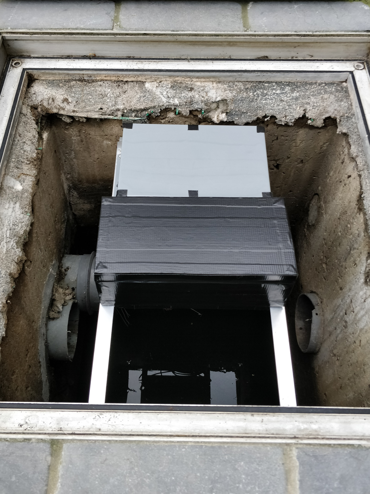

# Current issue: condensation on the sensor

## The problem

In november 2020 the measurement suddenly became unstable.

I had a look at the sensor and apparently there was so much condensation,
that some big drops of water where hanging at the bottom (active side) of the sensor.

Drying the sensor made the measurement stable again.

However, this is not a solution.

Some modification will be needed.

## Modification (November 2020)

The sensor was rotated 90 degrees, so that any condensation can drip off.
A reflection plate placed at 45 degrees ensures that the ultrasonic wave propagates in the correct direction.

As you can see, the mechanical setup reuses the original sensor mount.

Bottom view:

Detailed view:

Installed:

### Evaluation

The solution seemed to work well during winter.

However, due to frequent rainfall, the water level was continuously close to 100 %.

Around the middle of February, a dry period started end the water level started to fall.
The measurement however did not follow and somewhat later started to float heavily.

Inspection revealed that both the sensor and the reflection plate suffered from condensation again.
Drying them resulted in a stable measurement, until they suffered again from condensation later...

### Modification (March 2021)

Thermal isolation of the sensor + reflection plate from the other parts of the aluminum construction and bottom of the lid.

Sensor and reflection plate:

Mounting in isolating box:

Mounted:

Installed:

### Evaluation

The solution worked for a week, then: same problem. Changing weather conditions make it work well from time to time now.
Drying sensor and reflection plate always helps instantaneously, but the problem keeps on returning...
