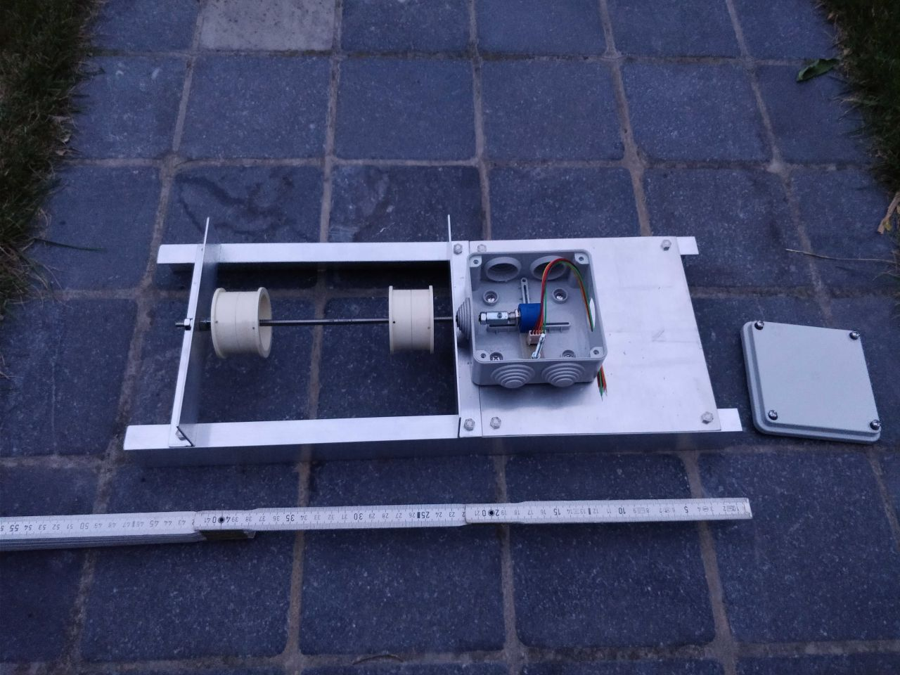
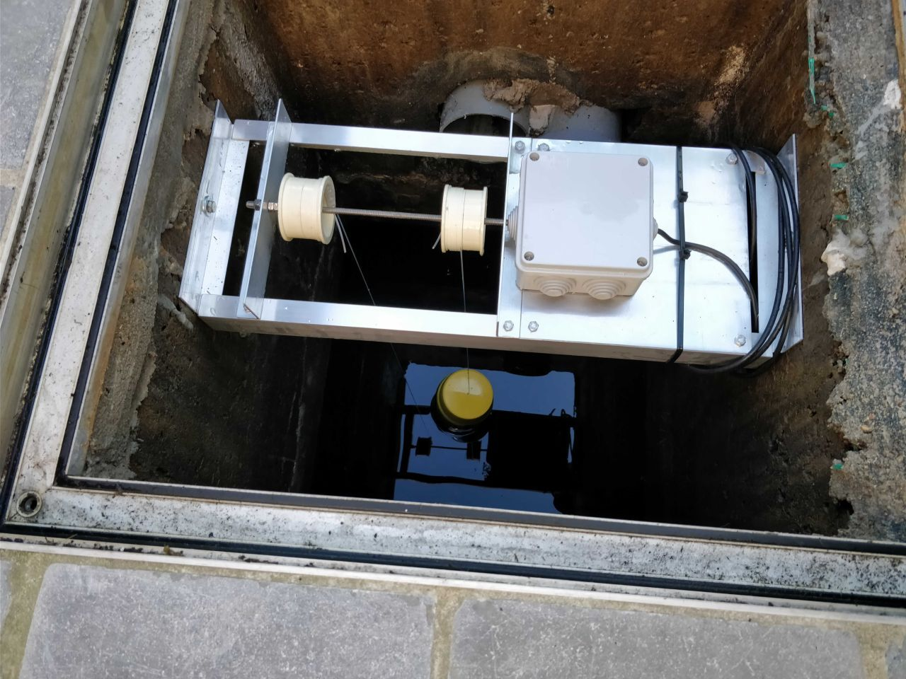

# A bit of history
First of all, I owe you a little bit of history.

## The good old days
In the so-called good days, measuring the water level was as easy as opening the lid
and putting a marked stick with markers in the water.

## The bricklayer
But then, the bricklayer came to build my new terrace.
He proposed a very nice new lid.
Very beautiful indeed and fastened with bolts.
But: not quickly removable!

## The easy solution with pulleys
Being rather conservative, I thought of a simple mechanical solution.
I made a solution with a rotating shaft, two pulleys, a float, a counterweight
and a multi-turn potentiometer.

I had to dimension the diameter of the pulleys so that the travel of the float
from an empty to a full reservoir would correspond to a little bit less than
the 10 turns range of the potentiometer.

The only thing left to do, was to pull a cable through the water pipe, via the roof, into my house.

From then on, I could calculate the water level from the resistance measured between two wires
of that cable. I measured simply with an ohm meter. 0 ohm corresponded to empty; 10 k-ohm corresponded to full.

If I ever had the time, I could read the analog value with a small embedded system,
and present the result in a nice way...

## The end
Unfortunately, it never got that far. The setup suffered from the moisture in the air above the water.
The plastic box was not sufficiently watertight where the shaft entered the box.
As a result: the potentiometer's runner stopped making contact due to oxidation and the ohm meter indicated infinite...
And that was the end of the easy solution...

## And then...
I got inspired by an old friend and ex-colleague, Koen, who solved this problem with an ultrasonic distance sensor.
I had already found out that the HC-SR04, an ultrasonic sensor well known to Arduino users, was not suited for this task,
because it is not waterproof.
But Koen found a waterproof alternative: the JSN-SR04T-2.0. This sensor is also used as a parking sensor in cars.

And then this project was born!
I ended up with my own implementation, in a different setup compared to Koen's:
- I could use wired communications, over the cable that was installed earlier.
- I could provide low voltage power, over the same cable.
- The physical situation in the area below the lid was different.

Enjoy further reading!

