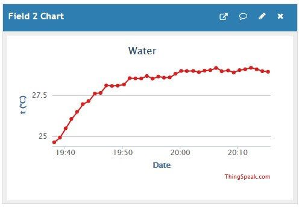

# Lesson learned: the temperature measurement

In the prototype, the temperature measurement seemed quite accurate.

However, in the final setup, the measurement suffers from self-warming
of the electronics in the waterproof box containing the transmitter.

This can be seen from the following graph, captured from ThingSpeak,
at an ambient temperature of about 26 °C.
The graph starts at power on and shows measurements at one minute intervals.
One can see a rise of the measured temperature of about 5°C during the warming up period,
while the ambient temperature can be assumed constant...

It's important to find a solution for this, because we're using the measured
temperature to correct the water level measurement, which depends on the speed of sound,
which on its turn depends on the temperature...

