# Lesson learned: condensation on the sensor

## The problem

In november 2020 the measurement suddenly became unstable.

I had a look at the sensor and apparently there was so much condensation,
that some big drops of water where hanging at the bottom (active side) of the sensor.

Drying the sensor made the measurement stable again.

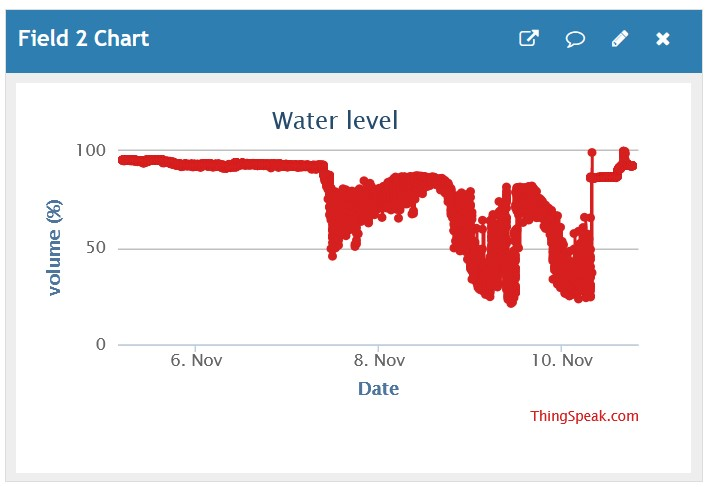

The reason for this condensation is obviously the combination of the following conditions:
* high vapor pressure
* bad ventilation
* cold sensor temperature 

## Attempt 1 (November 2020)

The idea behind this attempt is: give the water drops the possibility to drip off.

The sensor was rotated 90 degrees, putting the sensor surface vertically.
A reflection plate placed at 45 degrees ensures that the ultrasonic wave propagates in the correct direction.

As you can see, the mechanical setup reuses the original sensor mount.

Bottom view:

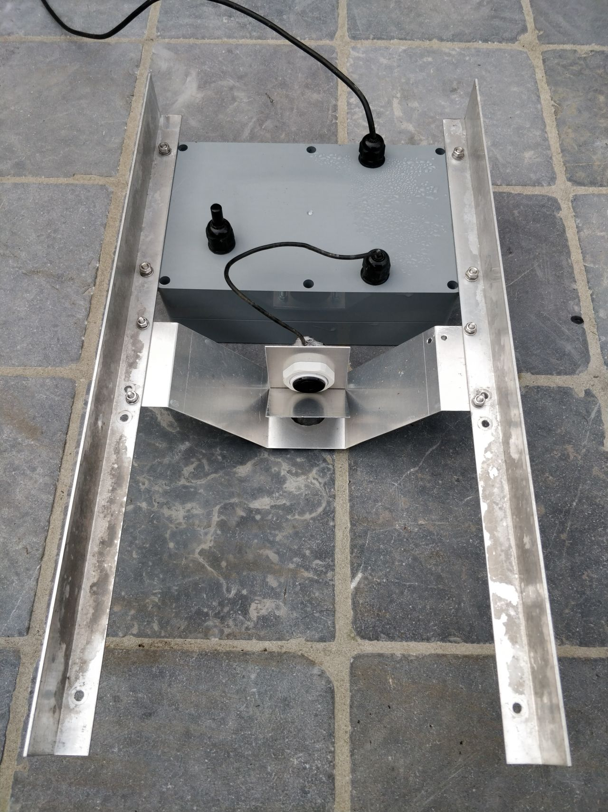

Detailed view:

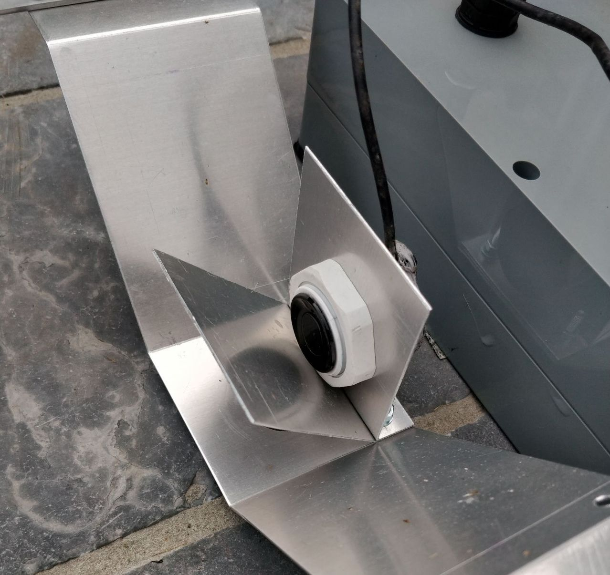

Installed:

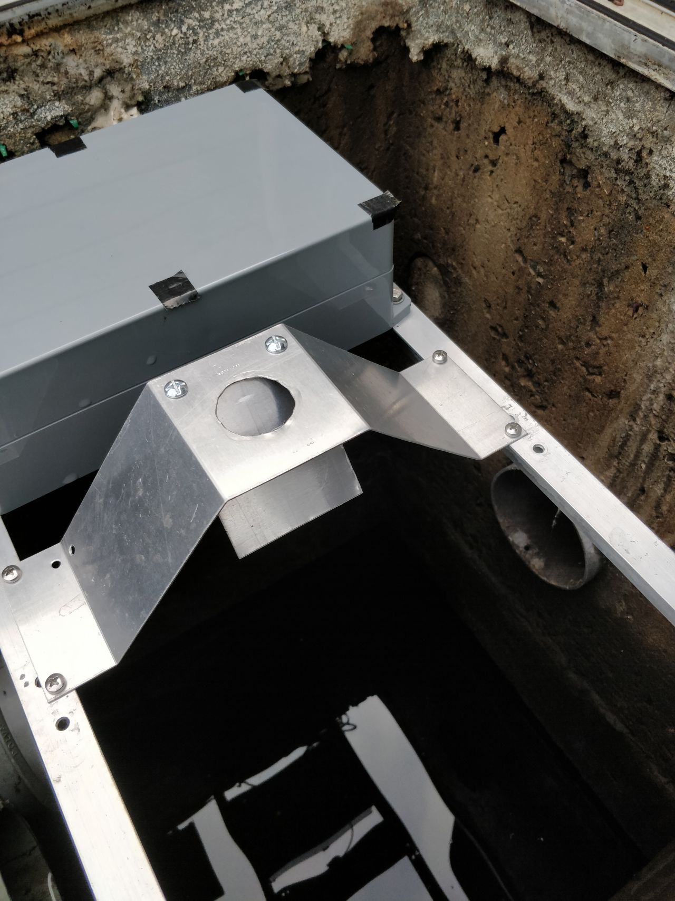

### Evaluation

The solution seemed to work well during winter.

However, due to frequent rainfall, the water level was continuously close to 100 %.

Around the middle of February, a dry period started end the water level started to fall.
The measurement however did not follow and somewhat later started to float heavily.

Inspection revealed that both the sensor and the reflection plate suffered from condensation again.
Drying them resulted in a stable measurement, until they suffered again from condensation later...

So clearly, this attempt is not a good solution

### Attempt 2 (March 2021)

The idea behind this attempt is: try to avoid low temperature at the sensor and the reflection plate, using isolation foam.

The sensor and the reflection plate were isolated as good as possible from the lid.

Sensor and reflection plate:

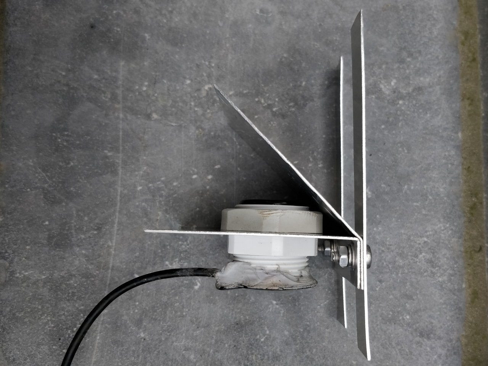

Mounting in isolating box:

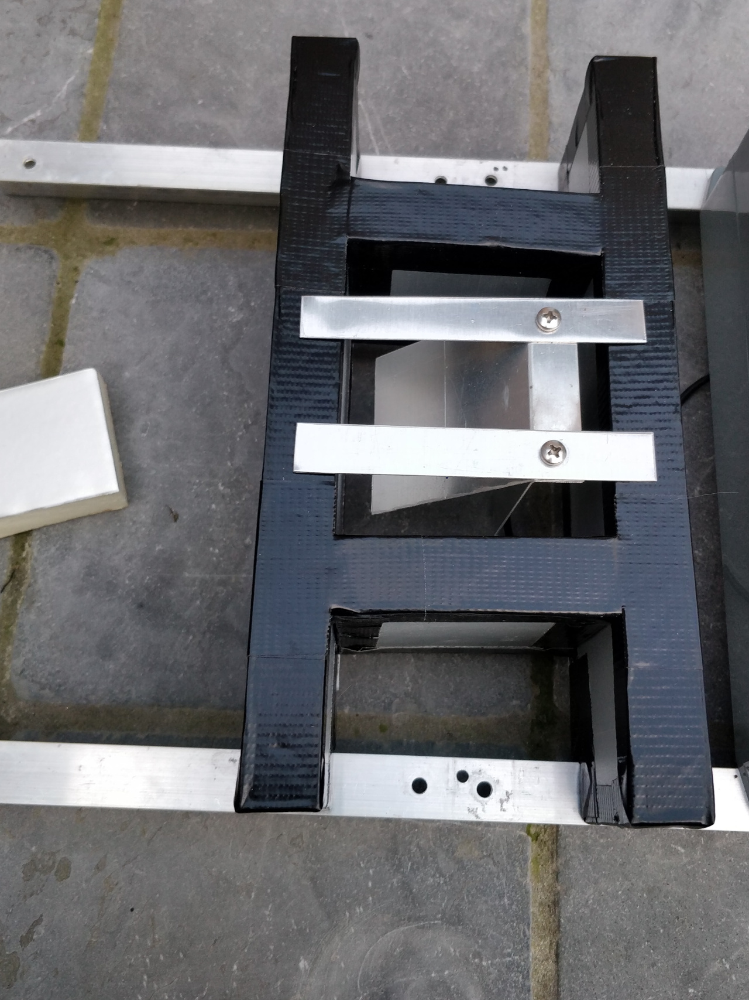

Mounted:

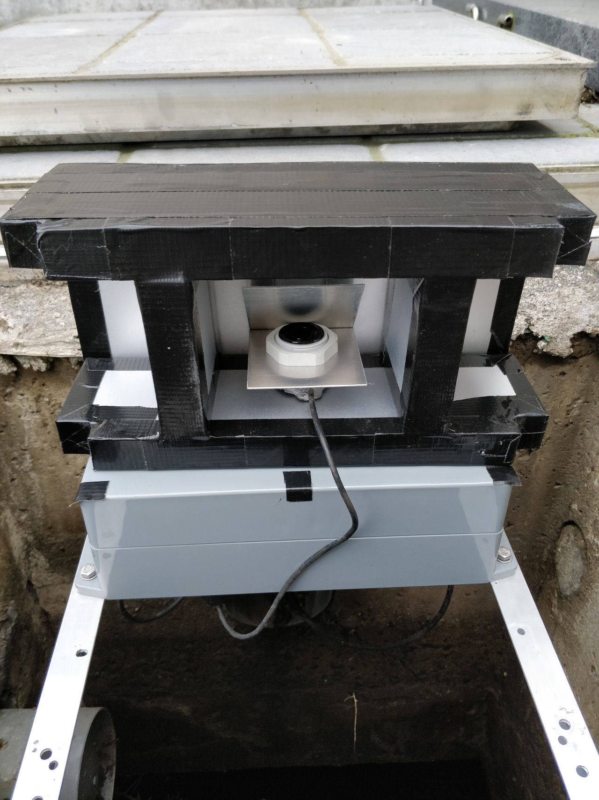

Installed:

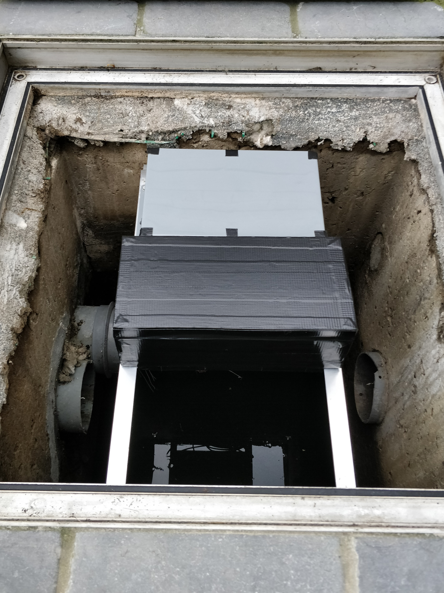

### Evaluation

The solution worked for a week, then: same problem. Changing weather conditions make it work well from time to time.
Drying sensor and reflection plate always helps instantaneously, but the problem keeps on returning...

### Attempt 3 (April 2021)

The input for this attempt is the observation that there is no condensation at the bottom of the plastic box.
Perhaps this is due to the small temperature rise due heat dissipation of the electronics.

The sensor was integrated in the bottom of the plastic box, and the voltage regulator (main source of dissipation)
was put on an aluminium frame, as close to the sensor as possible.
This can now become the hottest spot of the box and hopefully it will keep the sensor dry.

View inside the box:

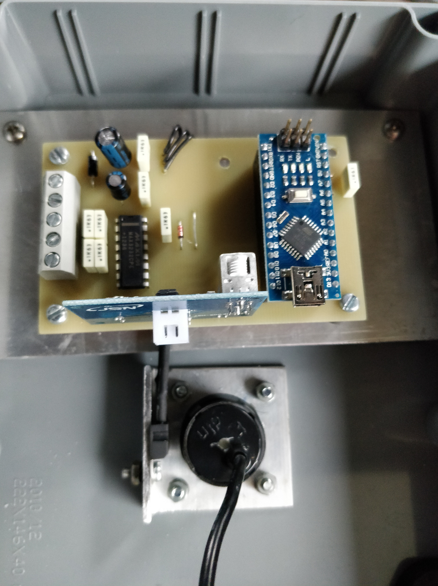

View of bottom of the box:

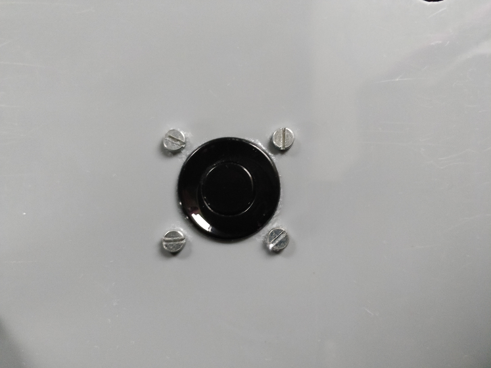

Mounted, box open:

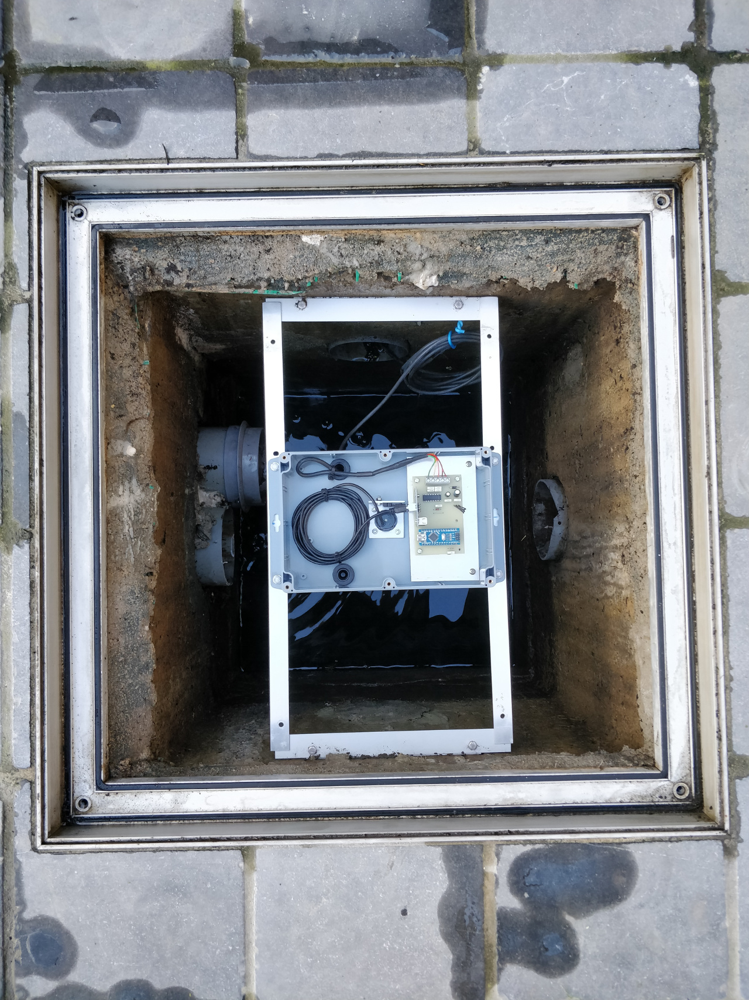

Installed:

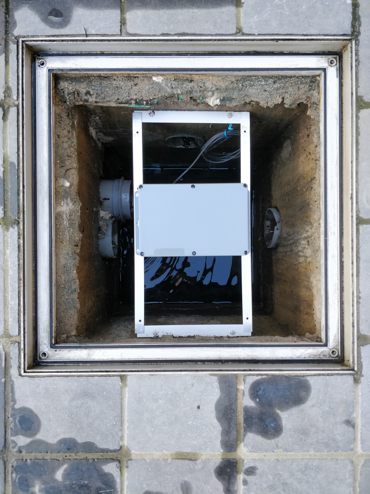

### Evaluation

More than one year later, today May 13th 2022, this attempt has not failed once. So I consider it a sufficient solution.