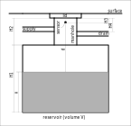

# Physical setup

## Description of the situation

The following drawing illustrates the physical setup.



The reservoir is located under the ground.

On top of the reservoir, there is a manhole.

The water, harvested from the roof of my house, enters the manhole via the supply pipe.

The drain pipe evacuates the excess water.

## Limits applicable to the sensor we're using
The JSN-SR04T-2.0 defines a measurement range from 20 cm to 600 cm, with a measurement angle of 75 degrees.

If we want to measure correctly up to and including the situation where the water level
reaches the top of the drain pipe, we'll have to choose the height of the sensor so that (inequality 1):
```
H4 - H3 > 20 cm
```
That is possible in my setup.

If we want to measure correctly for an empty reservoir, we'll have to verify that (inequality 2):
```
H1 + H2 - H3 < 600 cm
```
That is not a problem in my setup.

Now, what about the third limit of the sensor, the measurement angle?
Does it mean that
(a) objects with a surface perpendicular to the emitted signal can be detected within this angle
or
(b) objects with a surface not perpendicular to the emitted signal but within this angle will disturb the measurement?

I tested and luckily it's not (b); otherwise the walls of the manhole would have made measurements impossible...

## Formulas
Water level (or height, distance from the bottom of the reservoir):
```
x = H1 + H2 - H3 - d
```
(where d is the measured distance)

Water volume (% of fraction of V):
```
x(rel) = x / H1 * 100%
```
(for x <= H1; we consider the reservoir full, when the water level reaches the bottom of the manhole)

Water volume in the reservoir:
```
v = x / H1 * V
```
(also for x <= H1)

