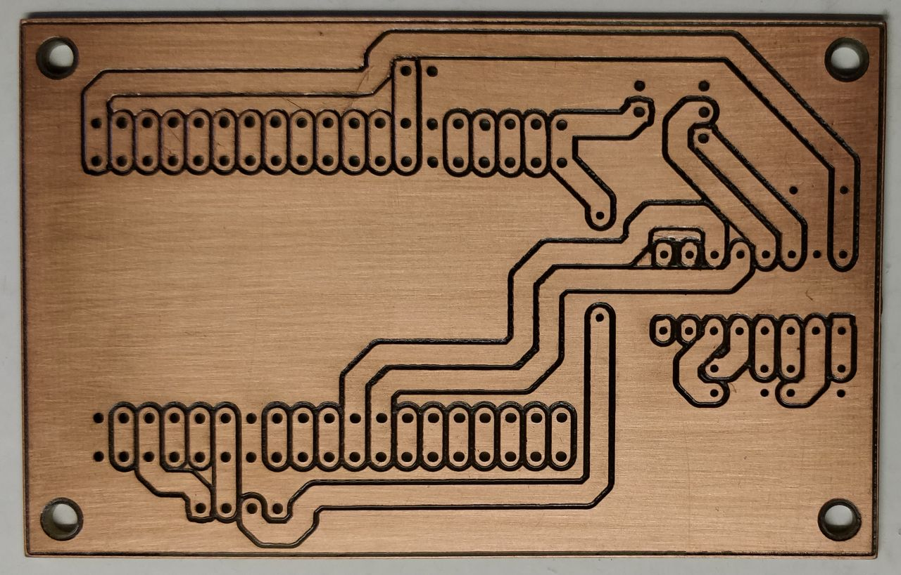
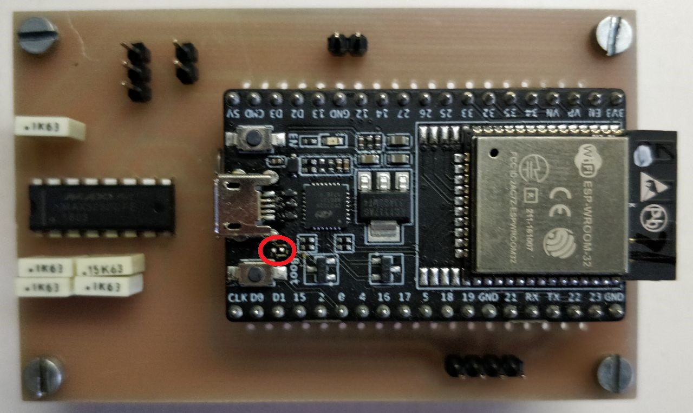
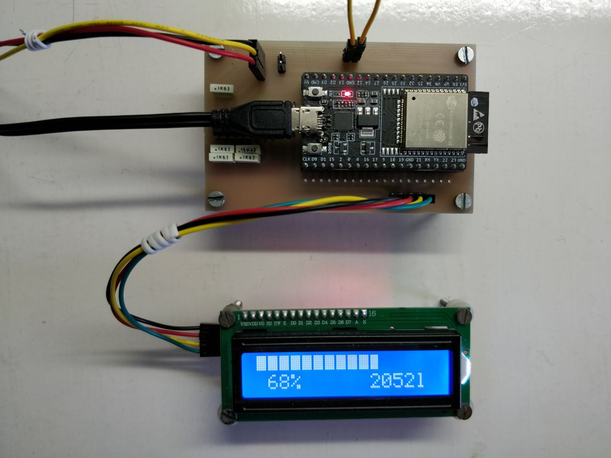
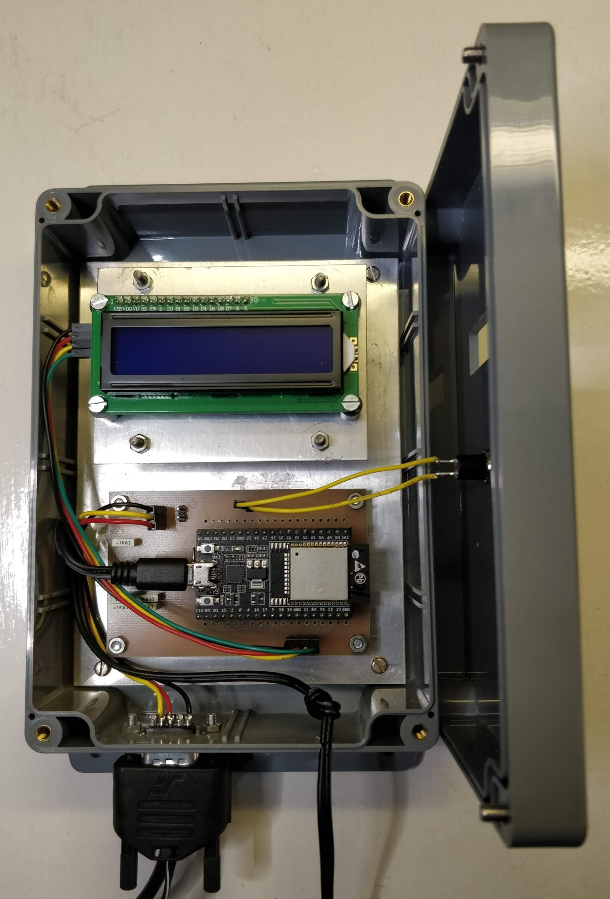
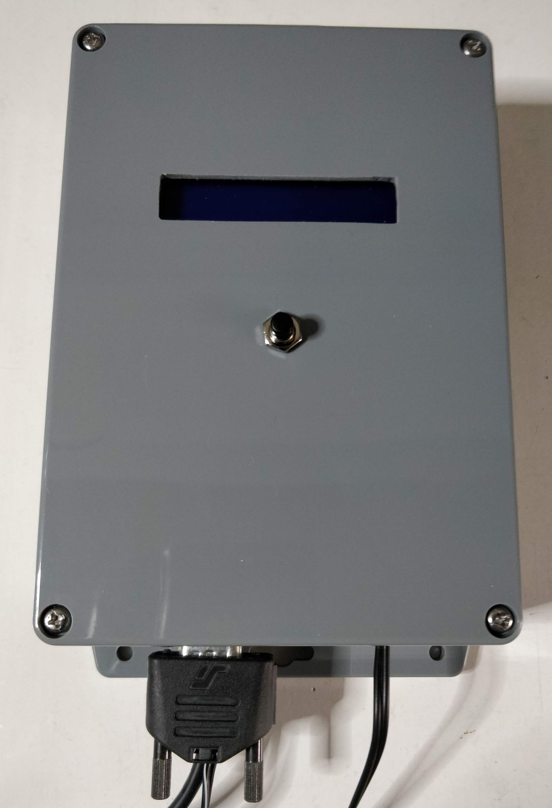

# Pictures related to the receiver

## The printed circuit board

**Many thanks to my friend and colleague Dylan who was so kind to mill
this printed circuit board, as he did for the transmitter earlier!**

Bottom view before assembly

Top view after assembly.
Note that on the ESP32-DevKitC V4 capacitor C15 was removed, as
[documented here](https://docs.espressif.com/projects/esp-idf/en/v3.3/get-started/get-started-devkitc.html#note-on-c15).

Wires connected and operational.
Note the processor board receives power from USB here, so J2 is not connected.

## The assembled box

The box (open).

The box (closed).

