# Pictures related to the transmitter

*The pictures shown below give an impression of the original implementation.
Some modifications were needed to solve the condensation issue explained in [this lesson learned](ll02.md).
So before trying to reconstruct, have a look at the solution found there!*

## The printed circuit board

**Many thanks to my friend and colleague Dylan who was so kind to mill
this printed circuit board on his self-made milling machine!**

Bottom view before assembly

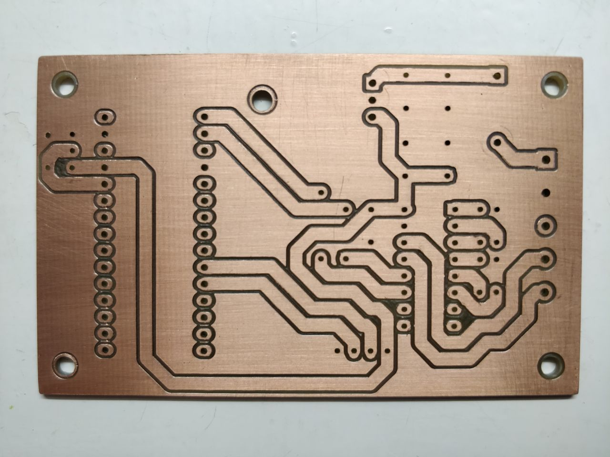

Top view after assembly

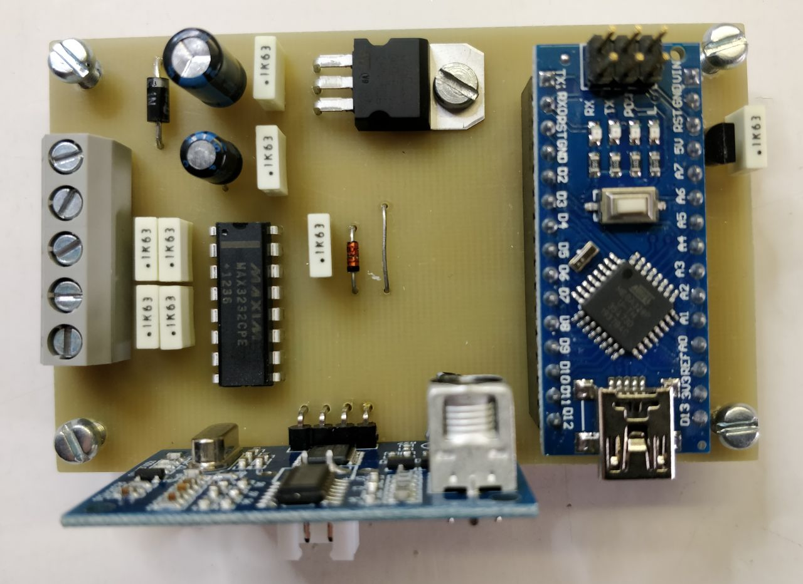

3D view after assembly

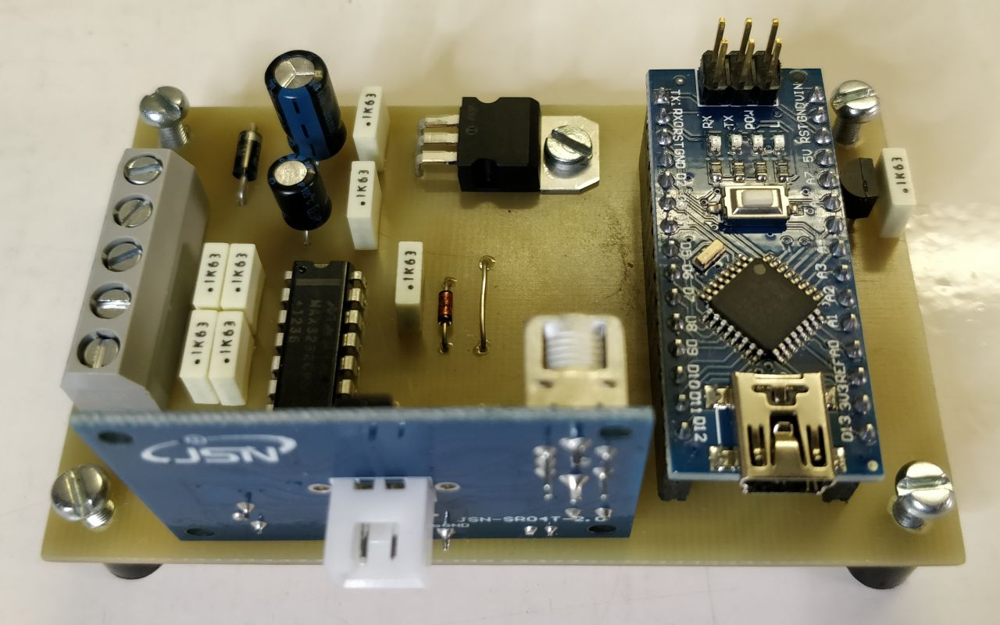

## The sensor

The sensor and a cable gland, well suited for mounting

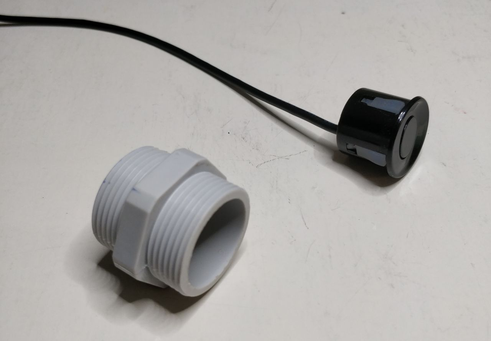

The sensor, mounted

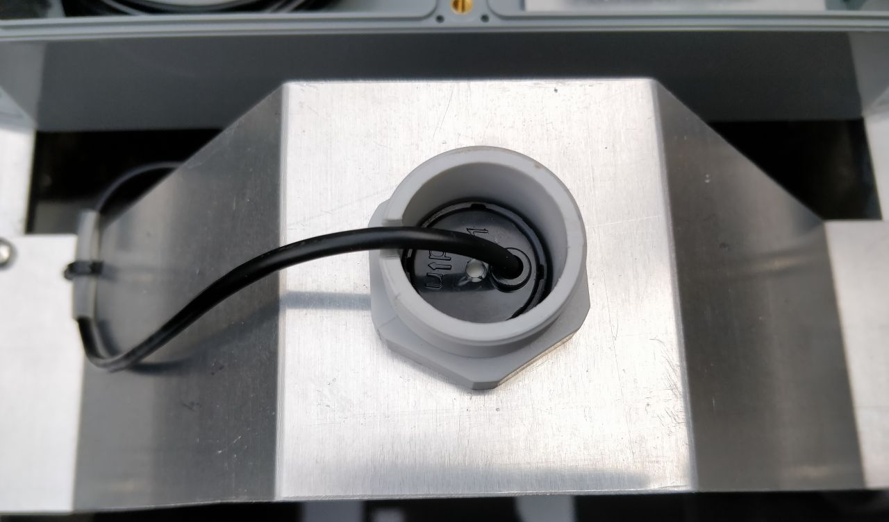

The sensor, mounted and sealed.
To seal, the plastic lid of a pepper bottle was glued to the cable gland with some TEC7.

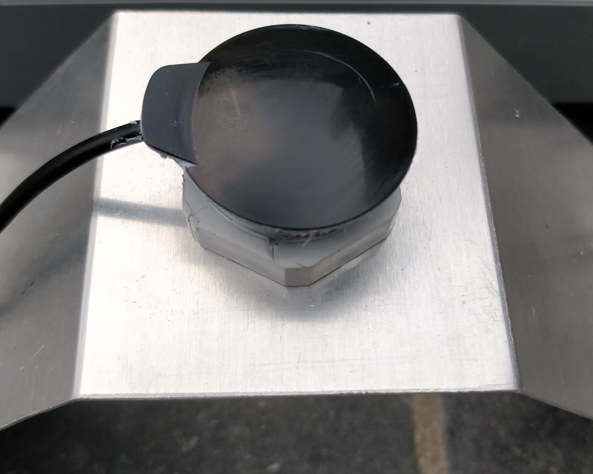

## The assembly

The assembly, before closing

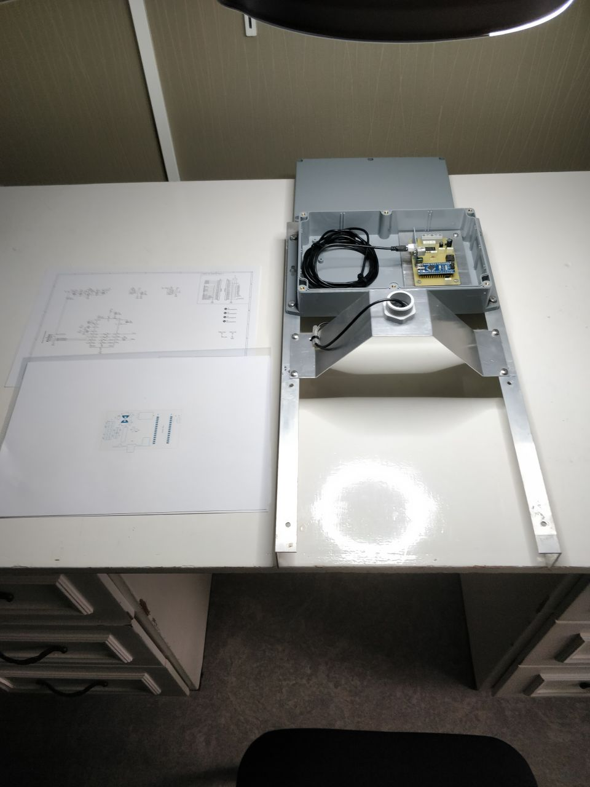

A view at the bottom of the assembly.
Note that the aluminium angle brackets at the sides are a bit dirty;
they are reused from [the past](history.md).

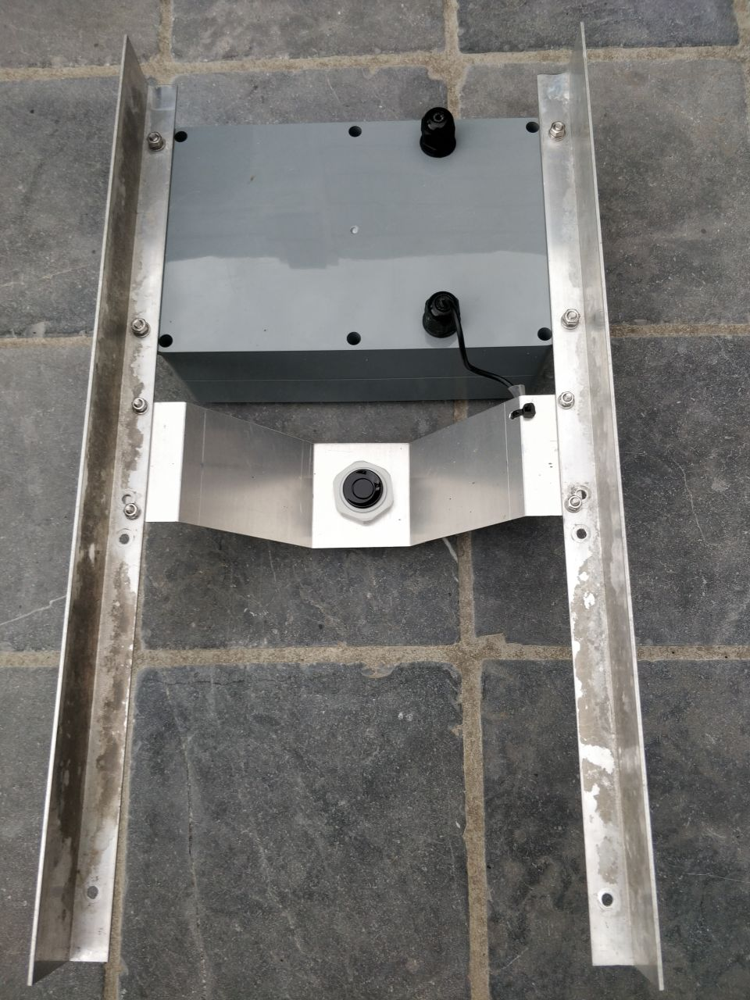

The manhole, prepared to contain the assembly.
Note the aluminium angle brackets placed against the walls of the manhole
and the cable that comes in via the pipe.

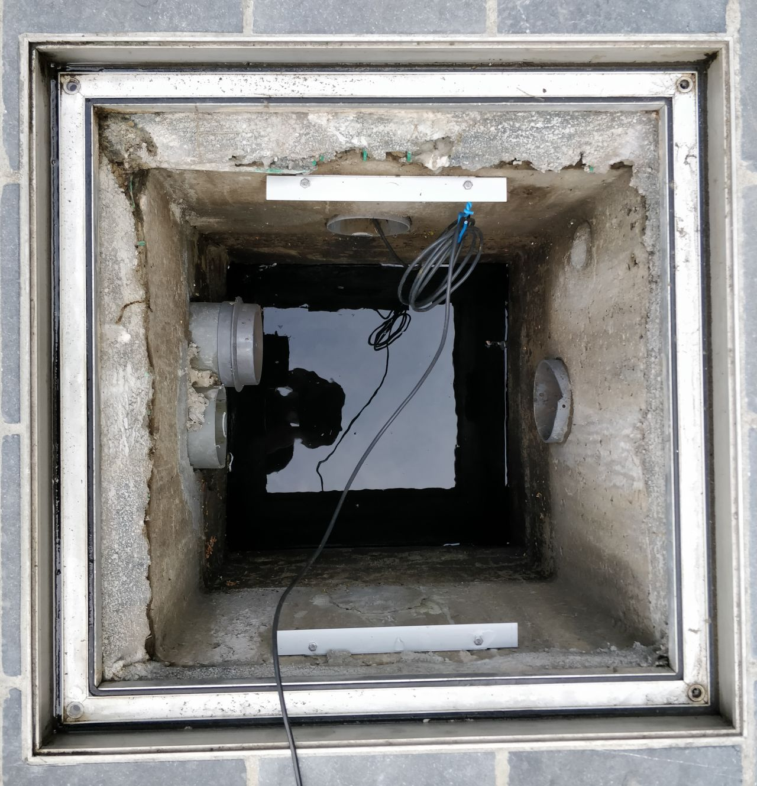

And finally, the end result.

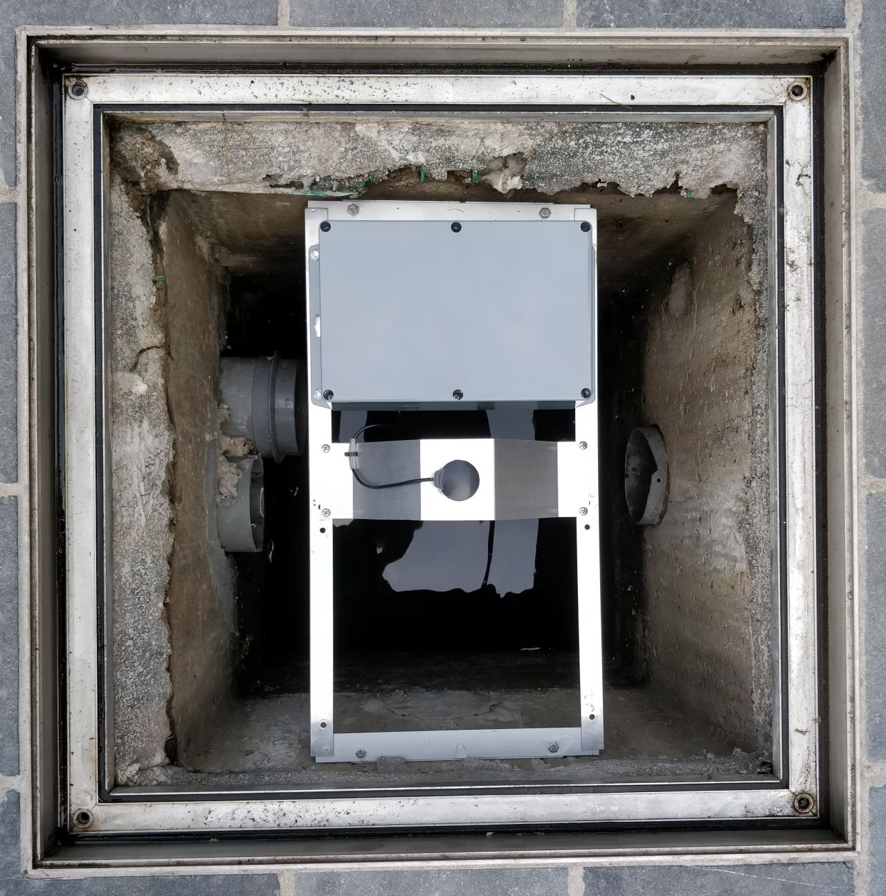

Lid closed, job done!

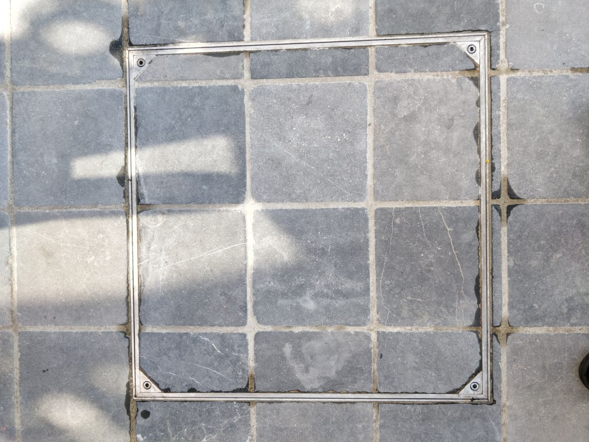

