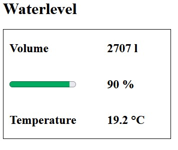

# The WaterLevelReceiver software

## Operation

Every second, the program sends a single "?" character to the Serial2 port, at 115200 Baud.
Each "?" acts as a request for a new measurement to the connected transmitter.
If all's well, the transmitter will reply with a JSON output as document in the [transmitter documentation](water-level-transmitter-software.md).

The receiver will decode this JSON payload and can publish it to several destinations,
depending on the version of the program.
The supported destinations:

- the serial port accessible through the USB connection (at 115200 Baud);
- a character-based LCD display using the hd44780 chip;
- a locally hosted webpage;
- MQTT, in this case to a topic "garden/waterlevel".

In addition, the program watches button input.
Currently, there is only one button defined:

- a button connected between GPIO12 and ground: controls LCD backlight (button closed = backlight on).

## Serial port output

Serial port output consists of:

- the temperature in numerical form;
- the volume in liters in numerical form;
- the volume as percentage in numerical form;
- a LOW indicator, only written if the level is low.

## LCD output

LCD output consist of:

- a representation of the volume as percentage in a bar graph;
- the volume as percentage in numerical form;
- the volume in liters in numerical form;
- a LOW indicator, only displayed if the level is low;
- a heartbeat indicator, changing between '*' and ' '.

## HTTP output

HTTP output can consist of all information available in the serial port output.

Currently, a simple HTML representation shows:

- volume in liters, in a HTML meter element and as percentage (the LOW indicator is represented with red volume values) 
- temperature in °C (red in case of frost)

An example:

## MQTT output

An MQTT server is accessed via WiFi using the Arduino library 'EspMQTTClient'
and the output is published on a single topic "garden/waterlevel" once per minute.

The payload is a JSON structure consisting of the fields:

- "t_C": the temperature;
- "vol_l": the volume in liters;
- "vol_percent": the volume as percentage;
- "low: the LOW indicator (true/false).

### Possibilities with MQTT

What follows is a non limiting list of examples.

#### Display data on Node-RED user interface elements

The Node-RED package `node-red-dashboard` has interesting nodes such as a **gauge**, allowing
to display output as shown below.

#### Export data to Influxdb for possible display using Grafana

The Node-RED contributed package `node-red-contrib-influxdb` has an **influxdb out** node, allowing to output data
to [Influxdb](https://www.influxdata.com/products/influxdb/).

These data can then be read by [Grafana](https://grafana.com/oss/), a great tool to visualise data.

## Testing

Some DEBUG... preprocessor definitions are available to assist debugging the code.
They provide possibilities to output debug information and to provide fake input.
