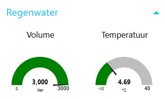
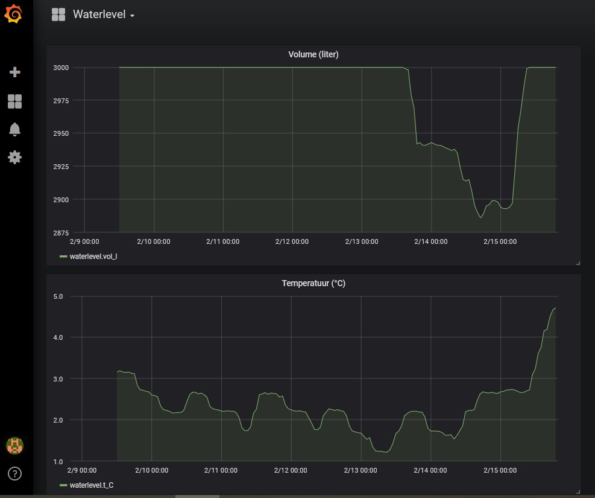

# The WaterLevelReceiver software

## Operation

Every second, the program sends a single "?" character to the Serial2 port, at 115200 Baud.
Each "?" acts as a request for a new measurement to the connected transmitter.
If all's well, the transmitter will reply with a JSON output as document in the [transmitter documentation](water-level-transmitter-software.md).

The receiver will decode this JSON payload and publish it to several destinations.
These are the supported destinations:
- the serial port accessible through the USB connection (at 115200 Baud);
- a character-based LCD display using the hd44780 chip;
- in earlier versions: a channel on https://thingspeak.com (now supported indirectly via MQTT and Node-RED);
- in current versions: an MQTT topic.

In addition, the program watches button input.
Currently, there is only one button defined:
- a button connected between GPIO12 and ground: controls LCD backlight (button closed = backlight on).

## Serial port output

Serial port output consists of:
- the temperature in numerical form;
- the volume in liters in numerical form;
- the volume as percentage in numerical form;
- a LOW indicator, only written if the level is low.

## LCD output

LCD output consist of:
- a representation of the volume as percentage in a bar graph;
- the volume as percentage in numerical form;
- the volume in liters in numerical form;
- a LOW indicator, only displayed if the level is low;
- a heartbeat indicator, changing between '*' and ' '.

## ThingSpeak output

### Earlier versions

In earlier versions, the ThingSpeak API was accessed directly via WiFi using the Arduino library 'ThingSpeak'
and the output was directed to a specific channel, to be created by the user.

Output to the ThingSpeak channel was reduced to one write per minute.

The output in the channel consists of:
- field 1: the volume in liters;
- field 2: the volume as percentage;
- field 3: the temperature;
- field 4: the LOW indicator (0 = OK; 1 = LOW).

For every successful write to ThingSpeak, the heartbeat indicator on the LCD output is overwritten with a '.'.

Note that in order to provide your personal secret values with respect to WiFi and ThingSpeak,
you must create your own secrets.h file, based on the instructions available in secrets_example.h.

#### A note about the implementation

The WiFi is controlled using a state machine rather than the approach found in the WiFi
and ThingSpeak examples, in order to avoid the 5 seconds blocking found in these examples.
This is to guarantee the one second update interval for the other destinations.

### Later versions

In later versions, there is no more direct connection from the board to ThingSpeak.
However, since the board is now publishing an MQTT topic, ThingSpeak can be reached indirectly as described in MQTT output below.

## MQTT output

An MQTT server is accessed via WiFi using the Arduino library 'EspMQTTClient'
and the output is published on a single topic "garden/waterlevel" once per minute.

The payload is a JSON structure consisting of the fields:
- "t_C": the temperature;
- "vol_l": the volume in liters;
- "vol_percent": the volume as percentage;
- "low: the LOW indicator (true/false).

#### Possibilities with MQTT

What follows is a non limiting list of examples.

**Connect to ThingSpeak**

Use an external tool to subscribe to the MQTT topic and forward the data to ThingSpeak from there.
An example for [Node-RED](https://nodered.org/) is available for import [here](WaterlevelToThingspeakFlow.json).
In addition to standard nodes, it depends on [ThingSpeak42](https://github.com/clough42/node-red-contrib-thingspeak42). 

**Display data on Node-RED user interface elements**

The Node-RED package node-red-dashboard has interesting nodes such as a **gauge**, allowing
to display output as shown below.

An example flow for this can be imported [here](WaterlevelToNodeRedUiFlow.json).

**Export data to Influxdb for possible display using Grafana**

The Node-RED contributed package node-red-contrib-influxdb has an **influxdb out** node, allowing to output data
to [Influxdb](https://www.influxdata.com/products/influxdb/).

These data can then be read by [Grafana](https://grafana.com/oss/), a great tool to visualise data.

An example flow can be imported [here](WaterlevelToInfluxdbFlow.json). It assumes local installations of Influxdb and Grafana.
 
## Testing

Some DEBUG... preprocessor definitions are available to assist debugging the code.
They provide possibilities to output debug information and to provide fake input.
